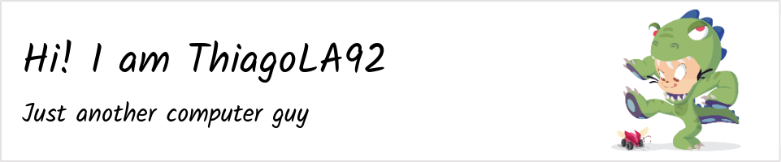

<picture>
  <source media="(prefers-color-scheme: dark)" srcset="https://github.com/thiagola92/thiagola92/raw/main/github-header-image-dark.png">
  
</picture>  

<picture>
  <source media="(prefers-color-scheme: dark)" srcset="https://github-readme-stats.vercel.app/api?username=thiagola92&show_icons=true&theme=dark&count_private=true">
  
</picture>  

<picture>
  <source media="(prefers-color-scheme: dark)" srcset="https://github-readme-stats.vercel.app/api/top-langs/?username=thiagola92&layout=compact&count_private=true&theme=dark">
  
</picture>  

[TODO: Overwrite some languages like LLVM, C++](https://github.com/github/linguist/blob/master/docs/overrides.md)  
